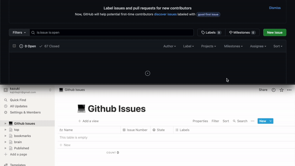

# GithubIssueToNotion

## Overview

Add a row to Notion's database when an issue is created on github.



## Must

`1. Access the URL and create a NotionDatabase from the template.`
https://kajirikajiri.notion.site/963ef208eda14cb592837a6c9b0d9be2?v=ab7609ff7de740fbb2d07708d70fadb9

`2. Access the URL and create Notion's Internal-api-key.`
https://www.notion.so/my-integrations

The official Notion description page is here.
https://developers.notion.com/docs/getting-started

`3. Allow the api-key created in step 2 to access the NotionDatabase page created in step 1.`
`3-1. Go to the NotionDatabase page created in step 1 and click Share in the upper right corner.`
`3-2. Click Invite and select the api-key you created in step 2.`

`4. Register the URL of the NotionDatabase page created in step 1 to Github Secret.`

key: NOTION_DATABASE_PAGE_URL
value: `URL of the NotionDatabase page created in step 1`

`5. Register Notion's internal-api-key created in step 2 to Github Secret.`

key: NOTION_INTERNAL_API_KEY
value: `Internal-api-key of Notion created in 2.`

`6. Create .github/workflows/GithubIssueToNotion.yml and paste the following.`

```
name: GithubIssueToNotion
on:
  issues:
    types: [opened]
jobs:
  build:
    runs-on: ubuntu-latest
    steps:      
      - uses: kajirikajiri/GithubIssueToNotion@v2.0.0
      - name: Github issue to Notion
        uses: kajirikajiri/GithubIssueToNotion@v2.0.0
        with:
          notion-internal-api-key: ${{ secrets.NOTION_INTERNAL_API_KEY }}
          notion-database-page-url: ${{ secrets.NOTION_DATABASE_PAGE_URL }}
          issue-title: ${{ github.event.issue.title }}
          issue-number: ${{ github.event.issue.number }}
          issue-state: ${{ github.event.issue.state }}
          issue-labels: ${{ toJSON(github.event.issue.labels) }}
          issue-url: ${{ github.event.issue.html_url }}
```